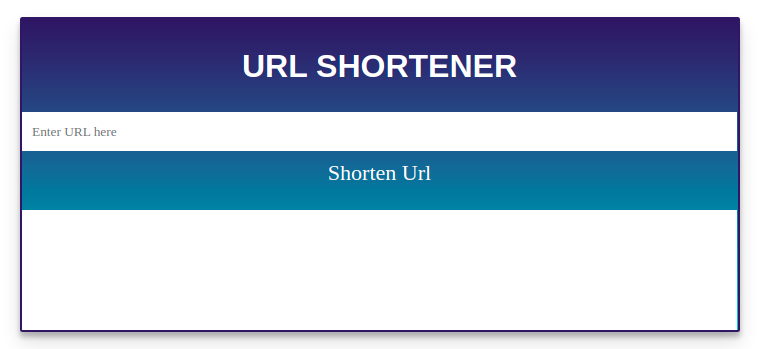

# URL SHORTENER
### _It couldn't be any simpler than that_

A **URL shortener** is a simple tool that takes a long URL and turns it into a *simpler URL* that is easy to handle. Since the dawn of the internet, links have been the way to get from one place to another online and precisely there still has no other way easier than that. But with the advent of a chunk of websites and links, each link gets lengthier and lengthier to maintain the uniqueness, hence a url shortener is one which tends to make our life easier. It’s much simpler to share a short and memorable URL than a lengthy one, especially when those lengthy URLs contain random numbers in them.

---
## Tech
The Url Shortener is built on the following technologies
- [Django] - High-level Python web framework that encourages rapid development and clean, pragmatic design
- [Html] - To create pages and make them functional
- [CSS] - To describe the presentation of a document written in a markup language
- [AJAX] - To make quick, incremental updates to the user interface without reloading the entire browser page. This makes the application faster and more responsive to user actions

---
## Installation
The primary requirement includes the presence of python 3 in the systems along with a helpful and convenient Code Editor as per the user (VS Code recommended)
Check the python version in your computer systems by running the following command in your shell
```sh
python --version
```
Install django for your system, if already available it confims its presence
```sh
pip3 install django
```
---
## Development
Firstly in our command shell, we set up the django project to our desired location
Run the following commands after the desired location is set
```sh
django-admin startproject urlshortener
```
Next up we open our file and create the app we shall be working on
```sh
cd shortener
django-admin startapp shortner
```
Now this sets up our project into our desired location and we can now open the same in our code editors and work on the same

---



   [Django]: <https://www.djangoproject.com/>
   [Html]: <https://html.com/>
   [CSS]: <https://css-tricks.com/>
   [AJAX]: <https://developer.mozilla.org/en-US/docs/Web/Guide/AJAX>
   [aabir13]: <https://github.com/aabir13>
  
  @author: [aabir13]
